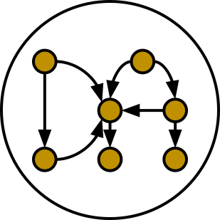

# Overview

**[[CODE](https://github.com/negrinho/deep_architect)]**
**[[DOCUMENTATION](https://deep-architect.readthedocs.io/en/latest/)]**
**[[PAPER](https://arxiv.org/abs/1909.13404)]**
**[[BLOG POST](https://negrinho.github.io/2019/07/26/introducing-deep-architect.html)]**
**[[GOOGLE GROUP](https://groups.google.com/forum/#!forum/deep_architect)]**
**[[COLAB](https://colab.research.google.com/drive/14xZdGB-BbIivdgNje3Gu7ZmK0m4F02kE)]**

<p align="center">
  
</p>

*DeepArchitect: Architecture search so easy you'll think it's magic!*

Check [colab](https://colab.research.google.com/drive/14xZdGB-BbIivdgNje3Gu7ZmK0m4F02kE) to play around with it and run examples.

## Introduction

DeepArchitect is a framework for automatically searching over computational graphs in arbitrary domains, designed with a focus on **modularity**, **ease of use**, **reusability**, and **extensibility**.
DeepArchitect has the following **main components**:

* a language for writing composable and expressive search spaces over computational
graphs in arbitrary domains (e.g., Tensorflow, Keras, Pytorch, and even non
deep learning frameworks such as scikit-learn and preprocessing pipelines);
* search algorithms that can be used for arbitrary search spaces;
* logging functionality to easily track search results;
* visualization functionality to explore search results.

<!-- what is there in store for both researchers and practicioners -->
For researchers, DeepArchitect aims to make architecture search research more reusable and reproducible by providing them with a modular framework that they can use to implement new search algorithms and new search spaces while reusing code.
For practitioners, DeepArchitect aims to augment their workflow by providing them with a tool to easily write search spaces encoding a large number of design choices and use search algorithms to automatically find good architectures.

## Installation

We recommend playing with the code on [Colab](https://colab.research.google.com/drive/14xZdGB-BbIivdgNje3Gu7ZmK0m4F02kE) first.

For a local installation, run the following code snippet:

```
git clone git@github.com:negrinho/deep_architect.git deep_architect
cd deep_architect
conda create --name deep_architect python=3.6
conda activate deep_architect
pip install -e .
```

Run one of the examples to check for correctness, e.g., `python examples/framework_starters/main_keras.py` or `python examples/mnist_with_logging/main.py --config_filepath examples/mnist_with_logging/configs/debug.json`.

We have included [utils.sh](https://github.com/negrinho/deep_architect/blob/master/utils.sh) with useful development functionality, e.g., to build documentation, extract code snippets from documentation, and build Singularity containers.

## A minimal DeepArchitect example with Keras

We adapt [this Keras example](https://github.com/keras-team/keras/blob/master/examples/mnist_cnn.py) by defining a search space of models and sampling a random model from it.
The original example has a single fixed three-layer neural network with ReLU activations in the hidden layers and dropout with rate equal to *0.2*.
We construct a search space by relaxing the number of layers that the network can have, choosing between sigmoid and ReLU activations, and the number of units for each dense layer.
Check this search space below:

```python
import keras
from keras.datasets import mnist
from keras.models import Model
from keras.layers import Dense, Dropout, Input
from keras.optimizers import RMSprop

import deep_architect.helpers.keras_support as hke
import deep_architect.modules as mo
import deep_architect.hyperparameters as hp
import deep_architect.core as co
import deep_architect.visualization as vi
from deep_architect.searchers.common import random_specify

batch_size = 128
num_classes = 10
epochs = 20

# the data, split between train and test sets
(x_train, y_train), (x_test, y_test) = mnist.load_data()

x_train = x_train.reshape(60000, 784)
x_test = x_test.reshape(10000, 784)
x_train = x_train.astype('float32')
x_test = x_test.astype('float32')
x_train /= 255
x_test /= 255
print(x_train.shape[0], 'train samples')
print(x_test.shape[0], 'test samples')

# convert class vectors to binary class matrices
y_train = keras.utils.to_categorical(y_train, num_classes)
y_test = keras.utils.to_categorical(y_test, num_classes)

# model = Sequential()
# model.add(Dense(512, activation='relu', input_shape=(784,)))
# model.add(Dropout(0.2))
# model.add(Dense(512, activation='relu'))
# model.add(Dropout(0.2))
# model.add(Dense(num_classes, activation='softmax'))

D = hp.Discrete


def dense(h_units, h_activation):
    return hke.siso_keras_module_from_keras_layer_fn(Dense, {
        'units': h_units,
        'activation': h_activation
    })


def dropout(h_rate):
    return hke.siso_keras_module_from_keras_layer_fn(Dropout, {'rate': h_rate})


def cell(h_units, h_activation, h_rate, h_opt_drop):
    return mo.siso_sequential([
        dense(h_units, h_activation),
        mo.siso_optional(lambda: dropout(h_rate), h_opt_drop)
    ])


def model_search_space():
    h_activation = D(['relu', 'sigmoid'])
    h_rate = D([0.0, 0.25, 0.5])
    h_num_repeats = D([1, 2, 4])
    return mo.siso_sequential([
        mo.siso_repeat(
            lambda: cell(
                D([256, 512, 1024]), h_activation, D([0.2, 0.5, 0.7]), D([0, 1])
            ), h_num_repeats),
        dense(D([num_classes]), D(['softmax']))
    ])


(inputs, outputs) = mo.SearchSpaceFactory(model_search_space).get_search_space()
random_specify(outputs)
inputs_val = Input((784,))
co.forward({inputs["in"]: inputs_val})
outputs_val = outputs["out"].val
vi.draw_graph(outputs, draw_module_hyperparameter_info=False)
model = Model(inputs=inputs_val, outputs=outputs_val)
model.summary()

model.compile(
    loss='categorical_crossentropy', optimizer=RMSprop(), metrics=['accuracy'])

history = model.fit(
    x_train,
    y_train,
    batch_size=batch_size,
    epochs=epochs,
    verbose=1,
    validation_data=(x_test, y_test))
score = model.evaluate(x_test, y_test, verbose=0)
print('Test loss:', score[0])
```

<!-- comments on the example. -->
This example shows how to introduce minimal architecture search capabilities given an existing Keras example.
Our search space encodes that our network will be composed of a sequence of *1*, *2*, or *4* cells, followed by a final dense module that outputs probabilities over classes.
Each cell is a sub-search space (underlining the modularity and composability of DeepArchitect).
The choice of the type of activation for the dense layer in the cell search space is shared among all cell search spaces used.
All other hyperparameters of the cell search space are chosen independently for each occurrence of the cell search space in the sequence.

The original single Keras model is commented out in the code above to emphasize how little code is needed to support a nontrivial search space.
We encourage the reader to think about supporting the same search space using existing hyperparameter optimization tools or in an ad-hoc manner (e.g. how much code would be necessary to encode the search space and sample a random architecture from it).

<!-- suggestions on going forward. -->
The [tutorials](https://deep-architect.readthedocs.io/en/latest/tutorials.html) and [examples](https://github.com/negrinho/deep_architect/tree/master/examples) cover additional aspects of DeepArchitect not shown in the code above.
[This](https://github.com/negrinho/deep_architect/blob/master/examples/mnist_with_logging/main.py) is a slightly more complex example using searchers and logging.
[These](https://github.com/negrinho/deep_architect/tree/master/examples/framework_starters) are minimal architecture search examples in DeepArchitect across deep learning frameworks.
They should be straightforward to adapt for your use cases.

## Framework components

The main concepts in DeepArchitect are:

* **Search spaces**: Search spaces are constructed by arranging modules (both basic and substitution) and hyperparameters (independent and dependent).
Modules are composed of inputs, outputs, and hyperparameters.
A search space is passed around as a dictionary of inputs and a dictionary of outputs, allowing us to seamlessly deal with search spaces with multiple modules.
Substitution modules rely heavily on delayed evaluation.
Search space transitions result from value assignments to independent hyperparameters.
Relevant code references to read for these ideas are [deep_architect/core.py](https://github.com/negrinho/deep_architect/blob/master/deep_architect/core.py) and [deep_architect/modules.py](https://github.com/negrinho/deep_architect/blob/master/deep_architect/modules.py).

* **Searchers**:  Searchers interact with search spaces through a simple API.
A searcher samples a model from the search space by assigning values to each independent hyperparameter, until there are no unassigned independent hyperparameters left.
A searcher is instantiated with a search space.
The base API for the searcher has two methods `sample`, which samples an architecture from the search space, and `update`, which takes the results for a sampled architecture and updates the state of the searcher.
Examples for the searcher API can be found at [deep_architect/searchers/common.py](https://github.com/negrinho/deep_architect/blob/master/deep_architect/searchers/common.py), [deep_architect/searchers/random.py](https://github.com/negrinho/deep_architect/blob/master/deep_architect/searchers/random.py), and [deep_architect/searchers/smbo.py](https://github.com/negrinho/deep_architect/blob/master/deep_architect/searchers/smbo.py).
It is also worth to look at [deep_architect/core.py](https://github.com/negrinho/deep_architect/blob/master/deep_architect/core.py) and for the traversal functionality to iterate over the independent hyperparameters in the search space.

* **Evaluators**:  Evaluators take a sampled architecture from the search space and compute performance metrics for it. Evaluators often have a single method named `eval` that takes an architecture and returns a dictionary with evaluation results. In the simplest case, there is a single performance metric of interest (e.g., validation accuracy).
See [here](https://github.com/negrinho/deep_architect/blob/master/deep_architect/contrib/misc/evaluators/tensorflow/classification.py) for an example implementation of an evaluator.

* **Logging**:  When we run an architecture search workload, we evaluate multiple architectures in the search space.
We maintain a folder per evaluation to keep track of the generated results (e.g., validation accuracy, number of parameters, example predictions, and model checkpoints).
Code for logging can be found in [deep_architect/search_logging.py](https://github.com/negrinho/deep_architect/blob/master/deep_architect/search_logging.py).
A simple example using logging is found [here](https://github.com/negrinho/deep_architect/blob/master/examples/mnist_with_logging/main.py).

* **Visualization**:  Visualization allows us to inspect the structure of a search space and to visualize search space transitions.
These visualizations can be useful for debugging, e.g., checking if a search space was correctly encoded.
There are also visualizations to calibrate the necessary evaluation effort to recover the correct performance ordering for architectures in the search space, e.g., how many epochs do we need to invest to identify the best architecture (e.g., lies in the top 5).
Code for visualization can be found in [deep_architect/visualization.py](https://github.com/negrinho/deep_architect/blob/master/deep_architect/visualization.py).

## Main folder structure

The most important source files live in the [deep_architect folder](https://github.com/negrinho/deep_architect/tree/master/deep_architect).
The tutorials cover much of the information needed to extend the framework.
See below for a high-level tour of the repo.

* [core.py](https://github.com/negrinho/deep_architect/blob/master/deep_architect/core.py): Most important classes to define search spaces.
* [hyperparameters.py](https://github.com/negrinho/deep_architect/blob/master/deep_architect/hyperparameters.py): Basic hyperparameters and auxiliary hyperparameter sharer class.
* [modules.py](https://github.com/negrinho/deep_architect/blob/master/deep_architect/modules.py): Definition of substitution modules along with auxiliary functionality to connect modules or construct larger search spaces from simpler search spaces.
* [search_logging.py](https://github.com/negrinho/deep_architect/blob/master/deep_architect/search_logging.py): Functionality to keep track of the results of the architecture search workload, allowing us to maintain structured folders for each search experiment.
* [utils.py](https://github.com/negrinho/deep_architect/blob/master/deep_architect/utils.py): Utility functions not directly related to architecture search, but useful in many related contexts such as logging and visualization.
* [visualization.py](https://github.com/negrinho/deep_architect/blob/master/deep_architect/visualization.py): Simple visualizations to inspect search spaces as graphs or sequences of graphs.

There are also a few folders in the deep_architect folder.

<!-- * [communicators](https://github.com/negrinho/deep_architect/tree/master/deep_architect/communicators): Simple functionality to communicate between master and worker processes to relay the evaluation of an architecture and retrieve the results once finished. -->
* [contrib](https://github.com/negrinho/deep_architect/tree/master/deep_architect/contrib): Useful code that may or may not be maintained over time. Contributions by the community will live in this folder. See [here](https://github.com/negrinho/deep_architect/blob/master/CONTRIBUTING.md) for an in-depth explanation for the rationale behind the project organization and the contrib folder.
* [helpers](https://github.com/negrinho/deep_architect/tree/master/deep_architect/helpers): Helpers for the current frameworks that we support. This allows us to take the base functionality defined in [core.py](https://github.com/negrinho/deep_architect/blob/master/deep_architect/core.py) and expand it to provide compilation functionality for computational graphs across frameworks. It should be instructive to compare support for different frameworks. One file per framework.
* [searchers](https://github.com/negrinho/deep_architect/tree/master/deep_architect/searchers): Searchers that can be used for search spaces defined in DeepArchitect. One searcher per file.
* [surrogates](https://github.com/negrinho/deep_architect/tree/master/deep_architect/surrogates): Surrogate functions over architectures in the search space. searchers based on sequential model based optimization are used frequently in DeepArchitect.

## Roadmap for the future

The community will have a fundamental role in extending DeepAchitect.
For example, authors of existing architecture search algorithms can reimplement them in DeepArchitect, allowing the community to use them widely.
This sole fact will allow progress on architecture search to be measured more reliably.
New search spaces for new tasks can be implemented, allowing users to use them (either directly or in the construction of new search spaces) in their experiments.
New evaluators and visualizations can be implemented.
<!-- The ability to  may be added to easily construct ensembles from the many models that were explored as a result of the architecture search workload. -->
Willing contributors should reach out and check the [contributing guide](https://github.com/negrinho/deep_architect/blob/master/CONTRIBUTING.md).
We expect to continue extending and maintaining the DeepArchitect and use it for our research.

## Reaching out

You can reach me at negrinho@cs.cmu.edu or at [\@rmpnegrinho](https://twitter.com/rmpnegrinho).
If you tweet about DeepArchitect, please use the tag `#DeepArchitect` and/or mention me ([\@rmpnegrinho](https://twitter.com/rmpnegrinho)) in the tweet.
For bug reports, questions, and suggestions, use [Github issues](https://github.com/negrinho/deep_architect/issues).
Use the [Google group](https://groups.google.com/forum/#!forum/deep_architect) for more casual usage questions.

## License

DeepArchitect is licensed under the MIT license as found [here](https://github.com/negrinho/deep_architect/blob/master/LICENSE.md).
Contributors agree to license their contributions under the MIT license.

## Contributors and acknowledgments

The lead researcher for DeepArchitect is [Renato Negrinho](https://www.cs.cmu.edu/~negrinho/).
[Daniel Ferreira](https://github.com/dcferreira) played an important initial role in designing APIs through discussions and contributions.
This work benefited immensely from the involvement and contributions of talented CMU undergraduate students ([Darshan Patil](https://github.com/dapatil211), [Max Le](https://github.com/lethenghia18), [Kirielle Singajarah](https://github.com/ksingarajah), [Zejie Ai](https://github.com/aizjForever), [Yiming Zhao](https://github.com/startrails98), [Emilio Arroyo-Fang](https://github.com/fizzxed)).
This work benefited greatly from discussions with faculty (Geoff Gordon, Matt Gormley, Graham Neubig, Carolyn Rose, Ruslan Salakhutdinov, Eric Xing, and Xue Liu), and fellow PhD students (Zhiting Hu, Willie Neiswanger, Christoph Dann, and Matt Barnes).
This work was partially done while Renato Negrinho was a research scientist at [Petuum](https://petuum.com).
This work was partially supported by NSF grant IIS 1822831.
We thank a generous GCP grant for both CPU and TPU compute.

## References

If you use this work, please cite:

```
@article{negrinho2017deeparchitect,
  title={Deeparchitect: Automatically designing and training deep architectures},
  author={Negrinho, Renato and Gordon, Geoff},
  journal={arXiv preprint arXiv:1704.08792},
  year={2017}
}

@article{negrinho2019towards,
  title={Towards modular and programmable architecture search},
  author={Negrinho, Renato and Patil, Darshan and Le, Nghia and Ferreira, Daniel and Gormley, Matthew and Gordon, Geoffrey},
  journal={Neural Information Processing Systems},
  year={2019}
}
```

The code for `negrinho2017deeparchitect` can be found [here](https://github.com/negrinho/deep_architect_legacy).
The ideas and implementation of `negrinho2017deeparchitect` evolved into the work of `negrinho2019towards`, found in this repo. See the [paper](https://arxiv.org/abs/1909.13404), [documentation](https://deep-architect.readthedocs.io/en/latest/), and [blog post](https://negrinho.github.io/2019/07/26/introducing-deep-architect.html). The code for the experiments reported in `negrinho2019towards` can be found [here](https://github.com/negrinho/negrinho2019towards), but it will not be actively maintained. For your work, please build on top of the `deep_architect` repo instead.
